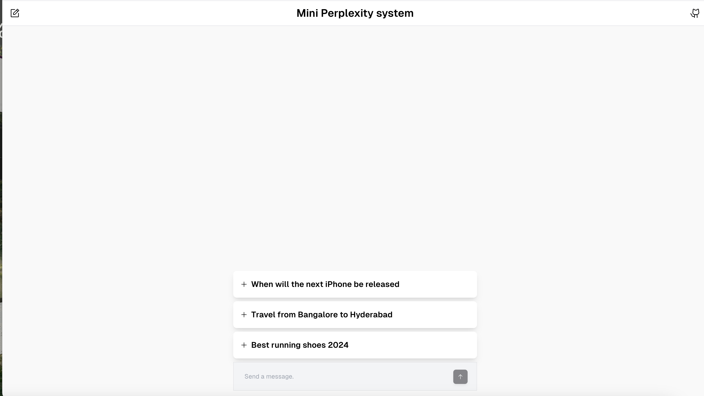
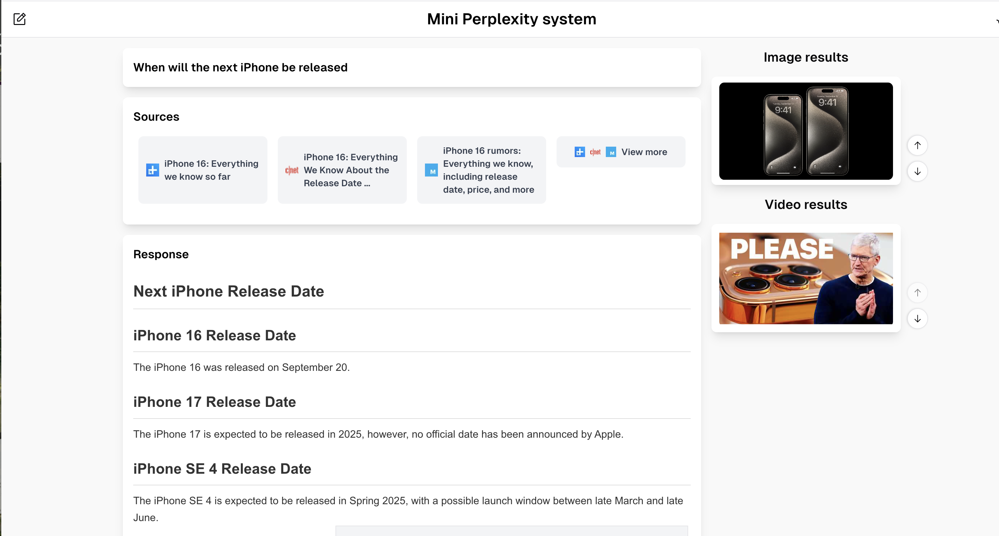
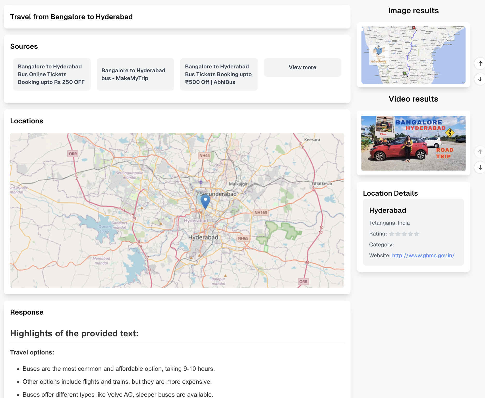
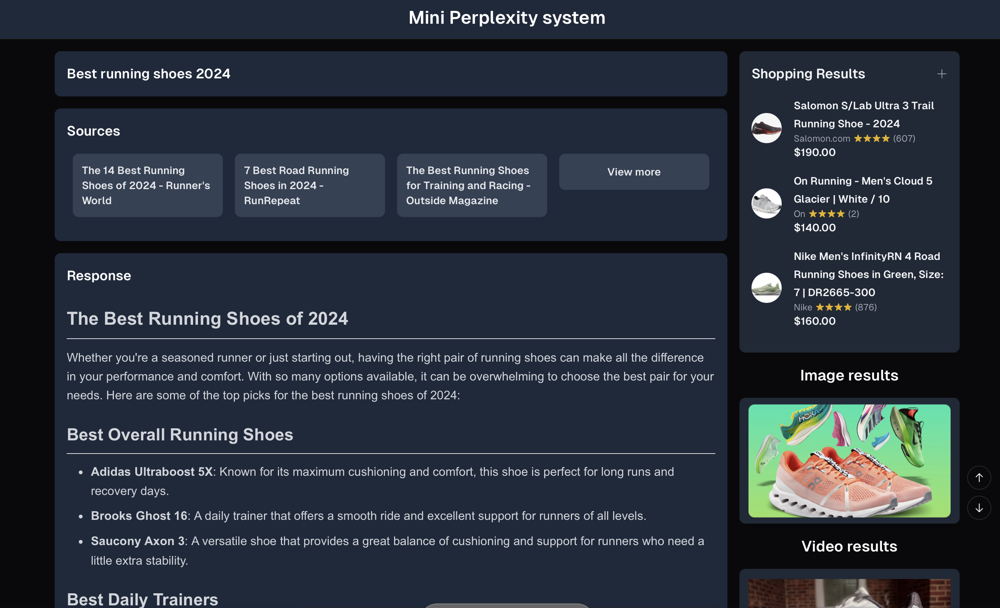
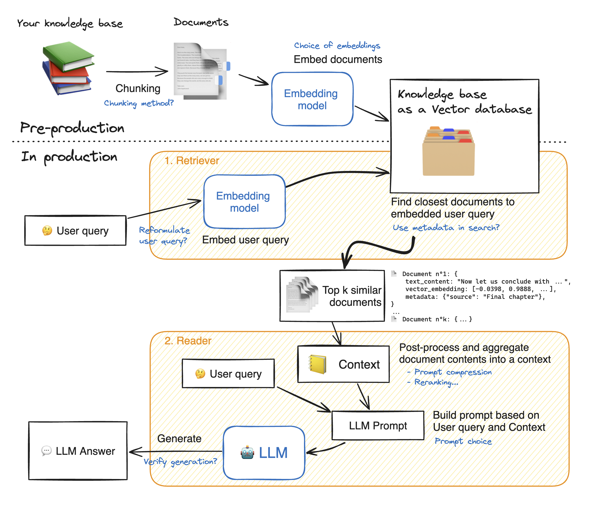

# Mini Perplexity Q&A System
This is an AI-powered search engine that combines traditional search capabilities with advanced language models to provide users with precise answers to their queries, accompanied by source citations inspired by [Perplexity](https://www.perplexity.ai/).

## Features
- Source citations
- Provide precise answers to user queries

## Additional Features
- UI for interacting with the search engine
- Follow up questions
- Image results
- Youtube Video results
- Shopping results
- Maps results using react-leaflet with details of each location in the map
- Dark mode based on browser preferences

The shopping results and map results are dynamicaaly rendered based on the user query.

## Setup and Installation
### Prerequisites
Obtain the following API keys:
- Open AI API key
- Brave Search API key
- Serper API key
- Google Custom Search API key
- Google Custom Search Engine ID
- Groq API key
### Installation

1. Clone the repository:
    ```
    git clone https://github.com/jitinchekka/llm-search-engine.git
    ```
2. Move in the directory
    ```
    cd llm-search-engine
    ```
3. Install the dependencies
    ```
    npm install --force
    ```
4. Create a `.env` file in the root directory and add the environment variables similar to the `.env.example` file
5. Start the development server
    ```
    npm run dev
    ```
6. Open the browser and navigate to `http://localhost:3000`

In case of a rate limit error, please change the `searchProvider` and `inferenceModel` to other providers in the `app/config.tsx` file

## Deployment steps
1. Build the project
    ```
    npm run build
    ```
2. Start the server
    ```
    npm start
    ```
3. Open the browser and navigate to `http://localhost:3000`

Deploy the project to a cloud provider like Vercel, Netlify, or Heroku


## Usage guidelines and examples
1. Enter a query in the search bar and click the post icon
2. The search results will be displayed on the screen
3. Click on the source link to view the source
4. Click on the image, video, shopping, or map tab to view the respective results
5. Click on the follow-up questions to get more information

Some example queries to try:
- Travel from Bangalore to Hyderabad
- How to make a chocolate cake
- Best running shoes in 2024
- Purchase iPhone 15

Sometimes the loading of the results, especially the text response, might take some time due to the API rate limits

Example usage screenshots:





## Design decisions and Technologies used
### Design decisions
Istead of a simply summarizing the scrapped content using an LLM, this is an implementation of an <b>advanced Retrieval-Augmented Generation (RAG) model</b>. In RAG the core idea is to combine retrieval from a knowledge source with generative capabilities to provide contextually accurate and enriched answers.

- The retrival is done using the configured search providers.
- After content retrieval, the text is split into chunks and vectorized using HuggingFace embeddings. This allows for efficient similarity search within the stored content, selecting the most relevant chunks to the original query.
- MemoryVectorStore holds these embeddings, enabling a similarity-based retrieval of documents directly related to the user’s question. This vector search is crucial in RAG setups as it provides contextually matched information to the generation phase.
- The generation phase is done using the `mixtral-8x7b-32768` model using the Langchain JavaScript library and groq cloud. This generates a comprehensive response using both the input question and the retrieved information.


The top level process flow of the backend is as follows:
1. The backend receives the user query
2. The input is rephrased used Groq
3. The rephrased query is searched using the configured search provider
4. The search results are normalized and the main HTML content is extracted after filtering
5. The data is processed and vectorized. 
6. The top sources are structured into a prompt and sent to OpenAI's Groq model for chat completion.
7. The response is streamed from groq
8. Follow up questions are generated using the same process
9. The response is sent to the frontend


### Optimizations
Firstly, instead of passing the entire content to the model, the content is split into chunks and vectorized. This allows for a more efficient similarity search within the stored content, selecting the most relevant chunks to the original query. 

1. Recursive Text Splitting is applied to break content into chunks for embedding, improving the accuracy of similarity searches
2. The processed content is stored as vectors using MemoryVectorStore with Hugging Face embeddings.
3. Similarity search is performed on the stored vectors to retrieve the most relevant content chunks. Facebook’s FAISS algorithm is internally used for this purpose for nearest neighbor search.

Groq's LPU model is used for chat completion, which is a more efficient and faster model compared to the GPT or Gemini models. It uses the `mixtral-8x7b-32768` model. It helped to reduce the response time and improve the overall performance of the system.

For vector embeddings, <b>`paraphrase-MiniLM-L3-v2`</b> is used, which has been selected by going throught the benchmarks on huggingface model hub. This model is perfect for my use case as it is optimized for embeddings and is faster compared to other models.

The frontend is optimized for performance using Next.js and Tailwind CSS. The search results are lazy-loaded to improve the initial load time. The images and videos are loaded only when the user clicks on the respective tabs.

### Technologies used
- Next.js
- Tailwind CSS
- Groq
- Langchain JavaScript Library
- Hugging Face Embeddings
- Brave Search API
- Open AI API
- Serper API (For image and video results)
- Google Custom Search API (For shopping results)
- React-Leaflet (For maps)

## External APIs and Integrations
External APIs and Libraries
#### OpenAI API:

Files:
- app/tools/generateRelevantQuestions.tsx
- app/tools/mentionFunctions/streamChatCompletion.ts
- app/tools/mentionFunctions/structuredUnlockSummarize.ts
- app/tools/streamingChatCompletion.tsx

Integration: Used for generating relevant questions, streaming chat completions, and summarizing content. The API is accessed via the `openai` symbol in various files.

#### Groq API:

Files:
- app/tools/contentProcessing.tsx

Integration: Utilized for chat completions using the `mixtral-8x7b-32768` model. The groqResponse symbol indicates its usage in processing content and handling chat responses.

#### Hugging Face Embeddings:

Files:
- app/tools/contentProcessing.tsx

Integration: Employed for generating vector embeddings using the paraphrase-MiniLM-L3-v2 model. The embeddings symbol is used to handle embedding operations.

#### Brave Search API:

Files:
- app/tools/searchProviders.tsx

Integration: Used for retrieving search results. The braveSearch function integrates this API to fetch relevant content.

#### Serper API:
Files:
- app/tools/searchProviders.tsx

Integration: Utilized for fetching image and video results. This API is mentioned in the README but specific file references are not provided.

#### Google Custom Search API:
Files:
- app/tools/searchProviders.tsx

Integration: Used for retrieving shopping results. 


## Future improvements and Roadmap
- Better error handling and logging
- Add an option to switch between different language models in the frontend
- Add a feature to allow users to provide feedback on the answers
- Add a rate limiter to prevent abuse
- Add a caching layer to improve performance